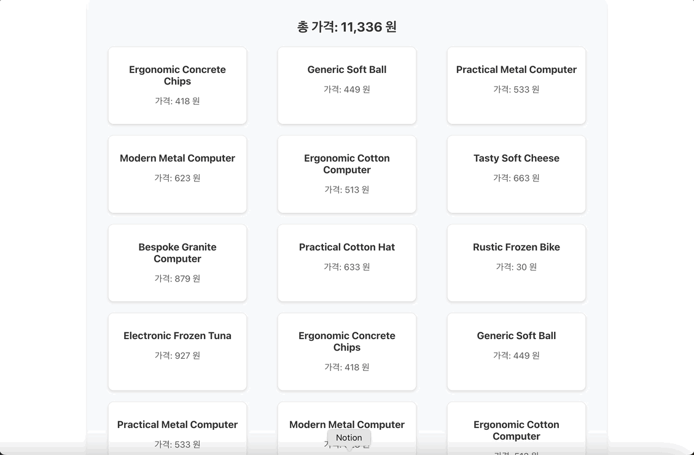

# 무한 스크롤이 적용된 상품 목록 페이지

**React**, **TypeScript**, **styled-components**를 사용하여 구현된 무한 스크롤 기능을 가진 상품 목록 페이지입니다.  
사용자가 스크롤을 내리면 자동으로 더 많은 상품이 로드되며, 총 가격을 계산하여 보여줍니다.

## 주요 기능

### 1. 무한 스크롤
- 스크롤이 하단에 도달할 때마다 새로운 상품 데이터를 불러옵니다.

### 2. 총 가격 계산
- 화면에 표시된 모든 상품의 가격을 실시간으로 합산하여 보여줍니다.

### 3. 로딩 및 종료 메시지
- 데이터 로딩 중에는 '불러오는 중...' 메시지가 표시됩니다.
- 모든 상품을 로드하면 '더 이상 불러올 제품이 없습니다.' 메시지가 표시됩니다.

